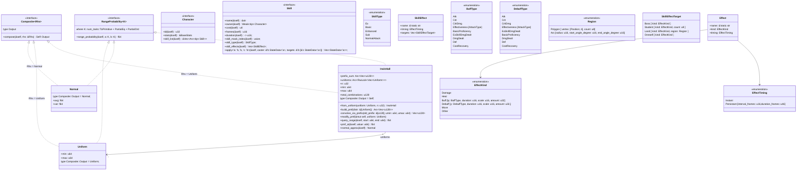

# 객체 관계도

```mermaid

classDiagram
    %% stochastic
    class Composite~Rhs~ {
        <<interface>>
        type Output
        +compose(&self, rhs: &Rhs) Self::Output
    }

    class RangeProbability~K~ {
        <<interface>>
        where K: num_traits::ToPrimitive + PartialEq + PartialOrd

        +range_probability(&self, a: K, b: K) f64
    }

    class Uniform {
        +min: u64
        +max: u64

        type Composite::Output = Uniform;
    }

    class IrwinHall {
        +prefix_sum: Arc~Vec~u128~~
        +uniforms: Arc~RwLock~Vec~Uniform~~~
        +n: u32
        +min: u64
        +max: u64
        +total_combinations: u128

        +from_uniform(uniform: Uniform, n: u32) IrwinHall
        +build_pmf(distr: &[Uniform]) Arc~Vec~u128~~
        -convolve_via_prefix(old_prefix: &[u128], umin: u64, umax: u64) Vec~u128~
        +modify_pmf(&mut self, uniform: Uniform)
        +query_range(&self, start: u64, end: u64) f64
        +pmf_at(&self, value: u64) f64
        +normal_approx(&self) Normal

        type Composite::Output = Self;
    }

    class Normal {
        type Composite::Output = Normal;

        +avg: f64
        +var: f64
    }

    %% core
    class Character {
        <<interface>>
        +id(&self)  u32
        +stats(&self) &BaseStats
        +skill_list(&self) &Vec~Arc~dyn Skill~~ 
    }

    class Skill {
        <<interface>>
        +name(&self) &str
        +owner(&self) Weak~dyn Character~
        +cost(&self) u8
        +frames(&self) u16
        +duration(&self) -> u16;
        +skill_mask_index(&self) usize;
        +skill_type(&self) SkillType;
        +skill_effects(&self) Vec~SkillEffect~;
        +apply<'a: 'b, 'b, 'c: 'b>(&self, caster: &'b StateData~'a~, targets: &'b [&'c StateData~'a~]) Vec~StateData~'a~~;
    }

    class SkillType {
        <<enumeration>>
        Ex
        Basic
        Enhanced
        Sub
        NormalAttack
    }

    class SkillEffect {
        +name: &'static str
        +timing: EffectTiming
        +targets: Vec~SkillEffectTarget~
    }

    class EffectTiming {
        <<enumeration>>
        Instant 
        Persistant [interval_frames: u16,duration_frames: u46]
    }

    class EffectKind {
        <<enumeration>>
        Damage
        Heal
        Buff [ty: BuffType, duration: u16, scale: u16, amount: u32]
        Debuff [y: DebuffType, duration: u16, scale: u16, amount: u32,]
        Move
        Other
    }

    class BuffType {
        <<enumeration>>
        Atk
        Crit
        CritDmg
        Effectiveness [AttackType]
        BasicProficiency
        ExSkillDmgDealt
        DmgDealt
        Def
        CostRecovery
    }

    class DebuffType {
        <<enumeration>>
        Atk
        Crit
        CritDmg
        Effectiveness [AttackType]
        ExSkillDmgDealt
        BasicProficiency
        DmgDealt
        Def
        CostRecovery
    }

    class Region { 
        <<enumeration>>
        Polygon [ vertex: [Position; 4], count: u8]
        Arc [radius: u16, start_angle_degree: u16, end_angle_degree: u16]
    }

    class SkillEffectTarget {
        Boss [ kind: EffectKind ]
        Student [ kind: EffectKind, count: u8 ]
        Land [ kind: EffectKind, region: Region ]
        Oneself [ kind: EffectKind ]
    } 

    class Effect {
        +name: &'static str
        +kind: EffectKind
        +timing: EffectTiming
    }

    IrwinHall "1" --> "*" Uniform : uniforms
    Composite~Rhs~ <|.. Normal : Rhs = Normal
    Composite~Rhs~ <|.. Uniform : Rhs = Uniform
    Composite~Rhs~ <|.. IrwinHall : Rhs = Uniform
    RangeProbability~K~ <|.. Uniform
    RangeProbability~K~ <|.. Normal
    RangeProbability~K~ <|.. IrwinHall
    Effect --> EffectKind
    Effect --> EffectTiming
    SkillEffectTarget

```
