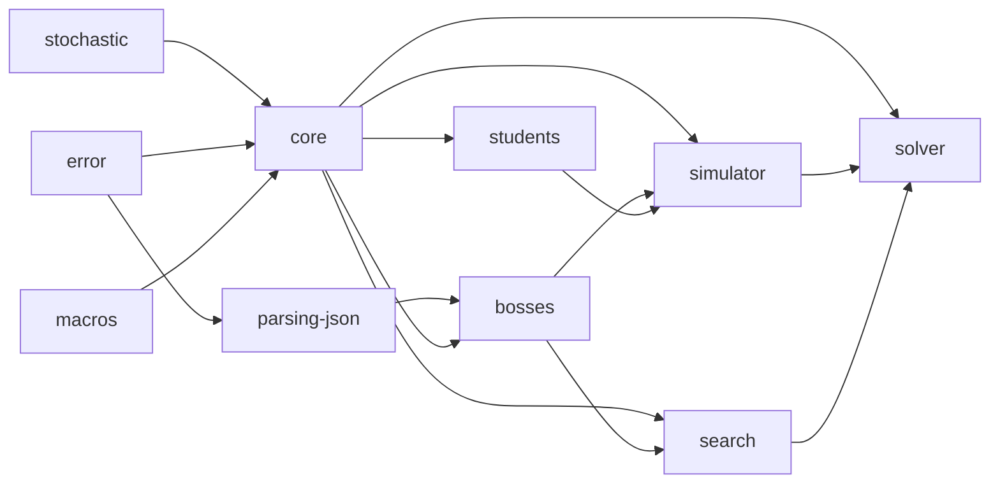

# 객체 관계도

## Core 전체 관계

```mermaid
flowchart TB

%% ═══════════════════════════════════════════════════════════════
%% TRAITS
%% ═══════════════════════════════════════════════════════════════

    subgraph traits["TRAITS"]
        Character_t["trait Character<br/>id() -> u32<br/>stats() -> &BaseStats<br/>skill_list() -> &Vec"]
        Stateful_t["trait Stateful<br/>new(students,boss,frames,cost) -> Self<br/>students() -> &[StateData]<br/>students_mut() -> &mut [StateData]<br/>boss() -> &StateData<br/>boss_mut() -> &mut StateData<br/>cost() -> i8<br/>frames() -> u16<br/>is_terminated() -> bool<br/>is_goal(f64) -> bool<br/>state_data_by_id(u32) -> Option"]
        Skill_t["trait Skill(T=())<br/>name() -> &str<br/>owner() -> Weak(Character)<br/>cost() -> u8<br/>frames() -> u16<br/>duration() -> u16<br/>skill_mask_offset() -> usize<br/>skill_type() -> SkillType<br/>skill_effects() -> Vec(SkillEffect)<br/>apply(&StateData, &[&StateData]) -> Vec(StateData)"]
        Simulator_t["trait Simulator<br/>legal_actions(state) -> Vec(Arc(Skill))<br/>apply(state,action) -> State<br/>advance(state,delta) -> Result<br/>next_event_frames(state) -> u16<br/>damage_map() -> &HashMap<br/>is_time_over(u16) -> bool<br/>lookup_skill(usize) -> Result<br/>character_by_id(u32) -> Option"]
        Agent_t["trait Agent<br/>solve(&S,f64) -> Vec(Arc(Skill))"]
        RLAgent_t["trait RLAgent<br/>policy(&S) -> Vec<br/>value(&S) -> f64"]
    end

    Agent_t -->|supertrait| RLAgent_t

%% ═══════════════════════════════════════════════════════════════
%% TRAIT IMPLEMENTATIONS
%% ═══════════════════════════════════════════════════════════════

    subgraph impls["IMPLEMENTATIONS"]
        Boss_char["Boss: Character"]
        Student_char["Student: Character"]
        Binah_char["Binah: Character"]

        create_state_impl["create_state! macro -> State: Stateful"]
        empty_impl["() : Stateful (via unreachable_impl)"]
    end

    Boss_char -->|impl| Character_t
    Student_char -->|impl| Character_t
    Binah_char -->|impl| Character_t
    create_state_impl -->|impl| Stateful_t
    empty_impl -->|impl| Stateful_t

%% ═══════════════════════════════════════════════════════════════
%% CHARACTERS
%% ═══════════════════════════════════════════════════════════════

    subgraph characters["CHARACTERS"]
        BaseStats["struct BaseStats<br/>level, hp(u64), atk(u32), def(u32)<br/>healing(u32), accuracy(u16), evasion(u16)<br/>crit(u16), crit_res(i32), crit_dmg(u32)<br/>crit_dmg_res(u32), stability(u16)<br/>stability_rate(u16), normal_attack_range(u16)<br/>sighting_range(u16), cc_power(u8), cc_res(u8)<br/>recovery_boost(u32), cost_recovery(u16)<br/>atk_speed(u32), mov_speed(u16)<br/>block_rate_bonus(i16), defense_piercing(u16)<br/>mag_count(u8), dmg_dealt(u32)<br/>dmg_resist(u16), ex_skill_dmg_dealt(u32)<br/>ex_skill_dmg_resist(u32)<br/>basics_proficiency(u32), healing_boost(u32)<br/>attack_type, armor_type<br/>explosive/piercing/corrosive/mystic/sonic_effectiveness(u32)<br/>buff_retention(u32), debuff_retention(u32)"]
        BossStats["struct BossStats<br/>name(String), id(u32)<br/>base_stats(BaseStats), terrain(Terrain)<br/>groggy_gauge(u64), groggy_duration(u8)"]
        Boss["struct Boss(T)<br/>stats(BossStats), other_stats(T)<br/>skills(Vec(Arc(Skill)))"]
        StudentSpec["struct StudentSpec<br/>id(u32), name(String)<br/>skill_levels([u8;4])<br/>weapon_level(u8), bond_level(u8)<br/>alter_bond_levels(Vec)<br/>gear_tiers([u8;10]), gear_levels([u8;10])<br/>talent_levels([u8;3])"]
        StudentStats["struct StudentStats<br/>student_stats(Box(StudentSpec))<br/>base_stats(BaseStats)"]
        Student["struct Student<br/>stats(StudentStats)<br/>skills(Vec(Arc(Skill)))"]
    end

    BossStats --> BaseStats
    Boss --> BossStats
    StudentStats --> BaseStats
    StudentStats --> StudentSpec
    Student --> StudentStats

%% ═══════════════════════════════════════════════════════════════
%% STATE & DAMAGE
%% ═══════════════════════════════════════════════════════════════

    subgraph state["STATE & DAMAGE"]
        StateData["struct StateData(EXTRA_BYTES)<br/>cooldowns(Vec(u16))<br/>remained_effects(BinaryHeap)<br/>accumulated_damage(Vec)<br/>damage_map(&HashMap)<br/>character(&Character)<br/>effects(SkillsBitMask)<br/>accumulated_damage_cache(DamageCache)<br/>coordinate(Position)<br/>extra([u8;EXTRA_BYTES])"]
        RemainedEffects["struct RemainedEffects<br/>ticks(u16), bit(u8)"]
        AccumulatedDamage["struct AccumulatedDamage<br/>ticks(u16), damage(Option(Damage))"]
        Position["struct Position<br/>x(f32), y(f32)"]
        DamageCache["struct DamageCache<br/>cached(Arc(RwLock(Option(IrwinHall))))<br/>last_len(Arc(AtomicUsize))"]
        SkillsBitMask["struct SkillsBitMask(u64)<br/>BOSS_BIT=1<<63<br/>SELF_BIT=1<<62<br/>ENEMY_BIT=1<<61<br/>DATA_MASK=low_61bits"]
        Damage["struct Damage<br/>normal(Uniform), crit(Uniform)<br/>crit_num(u32), crit_den(u32), flags(u32)"]
    end

    StateData --> RemainedEffects
    StateData --> AccumulatedDamage --> Damage
    StateData --> Position
    StateData --> DamageCache
    StateData --> SkillsBitMask
    Damage -->|uniforms from| Stochastic_Uniform

%% ═══════════════════════════════════════════════════════════════
%% SKILL EFFECTS
%% ═══════════════════════════════════════════════════════════════

    subgraph effects["SKILL EFFECTS"]
        SkillEffect["struct SkillEffect<br/>id(u32,u8), timing(EffectTiming)<br/>targets(Vec(SkillEffectTarget))"]
        SkillEffectTarget["enum SkillEffectTarget<br/>Boss(kind), Student(kind, count)<br/>Land(kind, region), Oneself(kind)"]
        EffectKind["enum EffectKind<br/>Damage, Heal<br/>Buff(ty,duration,scale,amount)<br/>Debuff(ty,duration,scale,amount)<br/>Move<br/>Other(fn(&T,S)->S)"]
        EffectTiming["enum EffectTiming<br/>Instant<br/>Persistent(interval,duration)"]
        Region["enum Region<br/>Polygon(vertex([Pos;4]),count(u8))<br/>Arc(radius,start_angle,end_angle)"]
        SkillType["enum SkillType<br/>Ex, Basic, Enhanced, Sub, NormalAttack"]
    end

    subgraph buffs["BUFFS & DEBUFFS"]
        BuffType["enum BuffType<br/>Atk, Crit, CritDmg<br/>Effectiveness(AttackType)<br/>BasicProficiency, ExSkillDmgDealt<br/>DmgDealt, Def, CostRecovery"]
        DebuffType["enum DebuffType<br/>Atk, Crit, CritDmg<br/>Effectiveness(AttackType)<br/>ExSkillDmgDealt, BasicProficiency<br/>DmgDealt, Def, CostRecovery"]
    end

    SkillEffect --> SkillEffectTarget --> EffectKind
    SkillEffect --> EffectTiming
    SkillEffectTarget --> Region
    EffectKind --> BuffType
    EffectKind --> DebuffType

%% ═══════════════════════════════════════════════════════════════
%% ACTIONS
%% ═══════════════════════════════════════════════════════════════

    subgraph actions["ACTIONS"]
        Action["struct Action(T)<br/>caster(u32), targets(Vec(u32))<br/>skill(Arc(T))"]
        ActionContext["enum ActionContext(T)<br/>Wait, Use(Action(T))"]
    end

    ActionContext --> Action --> Skill_t

%% ═══════════════════════════════════════════════════════════════
%% ENUMS
%% ═══════════════════════════════════════════════════════════════

    subgraph enums["ENUM TYPES"]
        AttackType["enum AttackType<br/>Normal, Explosive, Piercing<br/>Corrosive, Mystic, Sonic"]
        ArmorType["enum ArmorType<br/>Normal, Light, Heavy<br/>Composite, Special, Elastic, Structure"]
        Difficulty["enum Difficulty<br/>Normal, Hard, VeryHard<br/>Hardcore, Extreme, Insane<br/>Torment, Lunatic"]
        Terrain["enum Terrain<br/>Street, Outdoor, Indoor"]
        TerrainPower["enum TerrainCombatPowerState<br/>SS, S, A, B, C, D"]
        TerrainCombat["struct TerrainCombatPower<br/>street, outdoor, indoor(TCPS)"]
    end

    BaseStats --> AttackType
    BaseStats --> ArmorType
    BossStats --> Terrain
    TerrainCombat --> TerrainPower

%% ═══════════════════════════════════════════════════════════════
%% FUNCTIONS
%% ═══════════════════════════════════════════════════════════════

    subgraph functions["UTILITY FUNCTIONS"]
        fn_damage_scale["damage_scale(atk,armor) -> u32"]
        fn_is_weak["is_weak(atk,armor) -> bool"]
        fn_euclid["euclidean_distance(a,b) -> f64"]
        fn_cross["cross_product(p1,p2,q1,q2) -> f32"]
        fn_dot["dot_product(p1,p2,q1,q2) -> f32"]
        fn_inside["is_inside(p,region,bias) -> bool"]
    end

%% ═══════════════════════════════════════════════════════════════
%% MACROS
%% ═══════════════════════════════════════════════════════════════

    subgraph macros["MACROS (core)"]
        macro_create_state["create_state!(name, boss_extra, students...)<br/>counts extras, computes MAX_EXTRA_SIZE<br/>generates: State struct + impl Stateful"]
        macro_count_tt["count_token_trees!()"]
        macro_count_types["count_types!()"]
        macro_tuple_for["tuple_for!(), tuple_for_move!()"]
    end

    macro_create_state --> Stateful_t
    macro_create_state --> StateData
```

---

## Crate Dependency Graph

---

## 부록 — Architecture Notes

| 항목 | 설명 |
|------|------|
| `StateData.extra` | `const EXTRA_BYTES` 제네릭, `[u8; N]` inline 저장. `extra_as::<T>()` / `extra_as_mut::<T>()` 접근 |
| `create_state!` | `(name, boss_extra, student_extra...)` → MAX = max(size_of) → State struct + impl Stateful |
| `Skill(T=())` | `SubSkill`은 `T=SubSkillState` → `dyn Skill` (= `dyn Skill<()>`)에 못 담음 |
| `EffectKind::Other` | `fn(&T, S) -> S` 함수 포인터. concrete type 필요 (dyn으론 호출 불가) |
| `Simulation(T,N,S)` | S = create_state! 생성 concrete 타입. tick 기반 advance/apply |
| A* Search | `BinaryHeap<Reverse<Arc<Node>>>` open, `HashMap<S, u64>` closed |
| Solver | `Simulator` + `Algorithm` → `Agent` |
| Toolchain | `stable-x86_64-pc-windows-msvc` 필수 (gnu는 GUI crash) |
| UI | `eframe/egui 0.31`. Config/Results 탭. solver 연결 stub |
