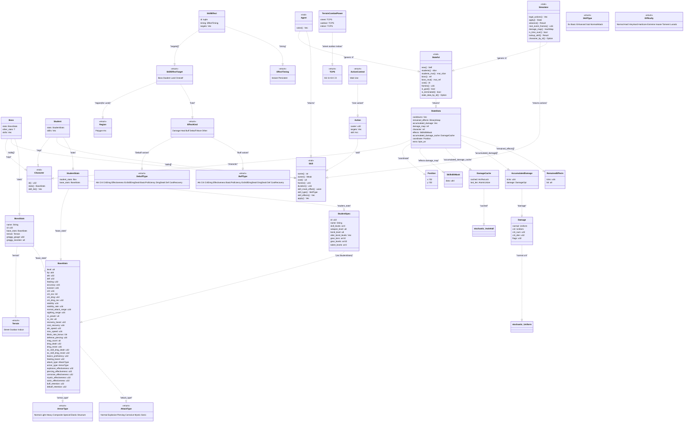
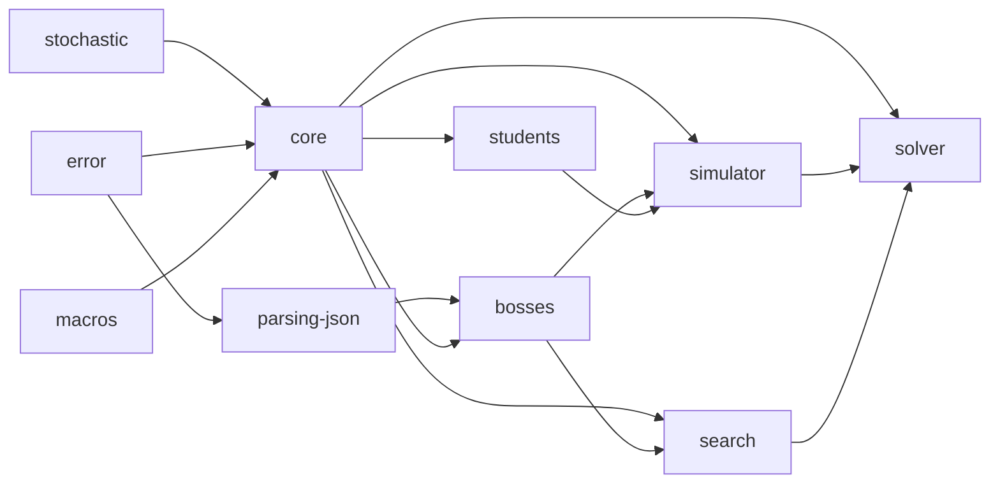

# 객체 관계도

## Core 전체 관계 (classDiagram)

---

## Crate Dependency Graph

---

## 아키텍처 노트

| 항목 | 설명 |
|------|------|
| `StateData.extra` | `const EXTRA_BYTES` 제네릭, `[u8; N]` inline. `extra_as::<T>()` / `extra_as_mut::<T>()` 접근 |
| `create_state!` | `(name, boss_extra, students...)` → MAX = max(size_of) → State + impl Stateful |
| `Skill(T=())` | `SubSkill`은 `T=SubSkillState` → `dyn Skill`에 못 담음 |
| `EffectKind::Other` | `fn(&T, S) -> S` 함수 포인터. concrete type 필요 |
| `Simulation(T,N,S)` | S = create_state! 생성 타입. tick 기반 advance/apply |
| A* | `BinaryHeap<Reverse<Arc<Node>>>` open, `HashMap<S, u64>` closed |
| Solver | `Simulator` + `Algorithm` → `Agent` |
| Toolchain | `stable-x86_64-pc-windows-msvc` 필수 (gnu GUI crash) |
| UI | `eframe/egui 0.31`. Config/Results 탭. solver stub |
